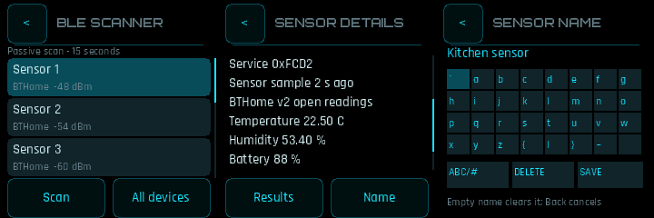

# BLE Scanner 0.2.0

The existing scanner now consumes the generic `bluetooth.sensors@1` provider.
Its explicit Scan/Stop, scrolling results/details and existing Nova/quick-control
surface remain. Scanning starts only after Bluetooth is enabled in the current
radio preferences; Airplane mode and unreadable settings fail closed.

## Open readings and names

The provider returns up to 32 detected identities, advertised name, address/type,
RSSI, age, services, manufacturer ID and raw bytes. Open BTHome v2 measurements
include battery, temperature, humidity, pressure, illuminance, voltage and charging.
Multiple measurements of the same type remain visible. Encrypted, invalid,
partial and unsupported data are labelled without inventing readings. The Sensors
filter selects recognized BTHome devices, including encrypted ones whose readings
are unavailable. Other BLE devices remain visible in All devices. GATT-only
sensors and other vendor formats are not yet decoded by this increment.

Select a result and tap Name. This stops scanning before editing. The standard
shared 32-key Watch keyboard accepts 24 printable ASCII characters. Save commits
and verifies the local record; Back cancels; saving an empty name clears the name.
A failed or uncertain readback stays in the editor with an explicit retry message.
Names are never transmitted to sensors or broadcast. No pairing or remote write
occurs. The name is a label for the observed address and address type, not proof
that the broadcast is trustworthy. It cannot follow a device that rotates its
private address. The detail screen explains that limitation for random addresses.

Named detected devices appear first, preserving discovery order within the named
and unnamed groups. The selected/detail identity stays stable when ordering changes.
Only currently detected devices appear; saved names do not create phantom results.
A new scan reloads matching aliases, so they persist across app restarts and ordinary
reboots. A full storage erase/reflash may erase names.

Aliases use versioned 40-byte CRC-checked values and `bs<type><12 hex digits>` keys
in the already-authorized preferences namespace 1. Each save is an explicit action;
there is no automatic write, address database enumeration or storage format. Missing
names are ordinary; corrupt/unreadable names are displayed as unavailable.

## Radio and lifecycle

The app has no private HCI parser or scan command generator. The sensor provider
uses the existing exclusive controller lease shared with NimBLE HID and telemetry.
The scanner's `PORTABLE_RADIO_SESSION` hook closes the provider before quick
controls, alerts, sleep, handoff or teardown. Unconfirmed cleanup retains its
invocation and grant. A safe failed power restoration is reported separately.
Dismissal/wake never restarts scanning and the app never changes saved radio policy.

The `bluetooth.hci` app grant remains only for the existing shared quick-control
adapter. Packet scanning uses the unique logical `bluetooth.sensors` instance 0.
The provider computes ages in its own clock domain; the app only adds elapsed time
after copying, so epoch differences cannot produce misleading sample ages.

## Build and deployment

`sdk/ble-sources.json` pins the shared System adapter and generic sensor driver.
The production app is tested together with the actual adapter, Nova rasterizer
and actual sensor provider above a synthetic controller. No RF is involved.

- `python scripts/test_ble_scanner.py --system-apps PATH`: normal/ASan/UBSan alias, app-flow and production-pixel checks.
- `python scripts/test_ble_renderer.py --system-apps PATH --drivers PATH`: real app/adapter/provider scrolling, idle, Stop, nested Back, quick controls and naming save/cancel, with grant/stride checks.
- `python scripts/build_ble_apps.py --system-apps PATH`: exact-pinned Xtensa ELF, structural validator, imports/exports, manifest and licensing evidence.
- The driver repository separately tests malformed packets, scalar decoding, HCI custody and 50,000 deterministic parser inputs.

A future Watch profile must add `ble-sensors/manifest.json` as a logical driver
without a hardware `instance_id`, with its existing HCI and platform-clock
capability dependencies. Grant the app `bluetooth.sensors@1` at instance 0 in
addition to its existing display/touch/alarm/preferences/quick-control grants.
Do not modify the accepted alarm-fix payload or install a mismatched old scanner
manifest with the new app. This PR does not install or activate these grants.

Keep standard Nova/alarm/navigation/sleep/quick-control flags plus
`PORTABLE_RADIO_SESSION`, `PORTABLE_APP_OWNS_TOUCH_CHROME`, an explicit
`PORTABLE_RETURN_APP`, and `lib/Bluetooth/include`. No System source edit is needed.

Physical discovery, timing, current, actual sensor compatibility, alert/sleep
interruption and real storage survival remain unqualified. This is a software
increment, not a hardware pass, firmware release, merge or installation.
