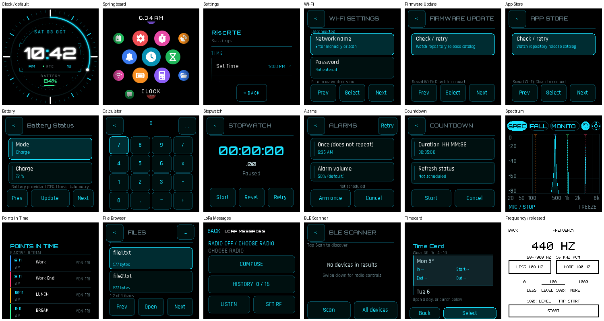
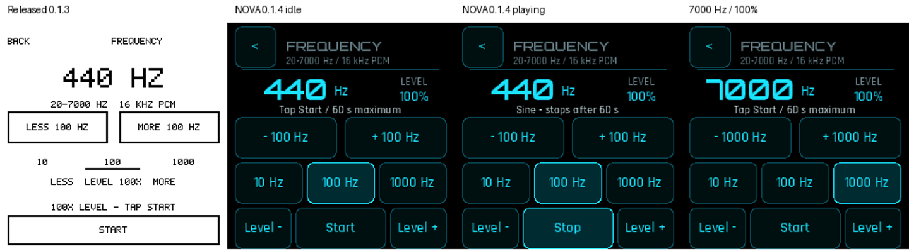

# Watch 1.0.2 NOVA-7 audit and remaining migration

## Result

The released source-bound cohort has **19 executable app identities**. Eighteen
already select their NOVA renderer, including the two Clock entrypoints that
share one renderer. **Frequency Generator 0.1.3 is the only legacy-themed screen.**
This increment changes that product to **0.1.4**, using existing shared helpers.
No already-correct screen or shared theme implementation is rewritten.

The baseline is Watch `27876749f08deaa78910cbd16aa54345684b6bf7`, its explicit
`apps/current-apps-sources.json` and `apps/current-cohort.json` (1.0.2), rather
than the older general `release/product.json` or descriptive cohort prose. The
exact source pins and per-app versions are in the [machine-readable inventory](evidence/nova7-20261006/changed-apps.json).

## Production-rendered inventory



These are actual production C app/adapter/renderer pixels executed with host
peripheral fixtures, not design mockups or substituted UI implementations.
Network names, file entries, time, readings and data are synthetic test inputs.
The launcher image is its settled production frame, after the fixture's separate
icon-coverage frame and transition. Clock/default share the shown NOVA renderer.
They are not photographs of a physical Watch.

| App | Released version | Finding |
| --- | --- | --- |
| default / Clock | 0.10.1 / 0.10.1 | Existing NOVA watchface; preserve |
| Springboard | 1.4.9 | Existing NOVA launcher; focus repair has separate owner |
| Settings | 1.2.5 | Visual reference; tap calibration has separate owner |
| Wi-Fi Settings | 1.1.3 | Existing NOVA rows and shared keyboard |
| Firmware Update / App Store | 1.1.2 / 1.1.2 | Existing NOVA rows/confirmation controls |
| Battery | 1.0.10 | Existing NOVA list; Power replacement has separate owner |
| Calculator | 0.1.5 | Existing NOVA keypad |
| Stopwatch | 0.1.5 | Existing NOVA numeric view/buttons |
| Alarms | 0.2.1 | Existing NOVA list/editor/buttons |
| Countdown | 0.1.4 | Existing NOVA list/editor/buttons |
| Frequency Generator | 0.1.3 | Legacy white/bitmap screen; migrate to 0.1.4 |
| Audio Spectrum | 0.4.3 | Visual reference; existing NOVA tabs/plots/keyboard |
| Points in Time | 0.4.3 | Existing NOVA list, wheels and keyboard |
| File Browser | 1.4.0 | Existing NOVA list, filter and preview |
| LoRa Messages | 0.1.1 | Existing NOVA controls/radio picker/shared keyboard |
| BLE Scanner | 0.1.0 | Existing NOVA list/details; preserve |
| Timecard | 0.1.0 | Existing NOVA week/day/editor/shared keyboard |

SDR/Waterfall and BLE HID are separate active increments, outside the released
19-app inventory and owned elsewhere. Later consolidation reserves Battery 1.1.0,
Settings 1.3.0 and Springboard 1.5.0, with Power/tap/focus already implemented on
their own branches. This work does not duplicate or overwrite those changes.

## Frequency Generator before / after



Intentional presentation differences:

- Black/cyan palette, the existing Orbitron numeric and Rajdhani text faces,
  standard NOVA header and rounded shared buttons
- Every touch target is at least 44 pixels tall
- Frequency and level remain visible together; limits/sample rate remain in
  the header and status remains beneath the values
- All eight action controls remain directly accessible on the same screen:
  frequency minus/plus, 10/100/1000 Hz steps, level minus/plus, Start/Stop
- The level buttons move beside Start/Stop; no added page, mode, hidden control,
  extra navigation step or keyboard is introduced

Unchanged behavior: 20–7000 Hz, 16 kHz mono sine PCM, 10/100/1000 Hz steps,
100% initial digital level and 0–100% range, smooth phase/amplitude edits,
explicit Start, paired Confirm/touch coalescing, 60-second cutoff, no auto-start,
existing touch/crown Back and launcher handoff, and audio ownership/cleanup on
Stop, alarm/sleep/foreground interruption. No data store, provider API, gain
control, Runtime ABI or shared adapter is changed.

## Verification and integration

The actual Frequency app and production adapter are run for 14 scenarios in
ordinary and ASan/UBSan builds: idle, all step choices, one-step level changes,
both level clamps, frequency clamps, repeated Start/Stop, touch and hardware
Back, simultaneous Confirm/touch Stop, 60-second cutoff, and Quick Controls
from two volume states. All rendered frames are 240x240; stride guards and
provider grants are checked. The legacy 15-scenario audio fault/controller
suite and tone-core property checks still pass. Python inventory tests pass.
Target Audio Tools ELFs use the pinned Xtensa 8.4.0 compiler, exact clean
System adapter `fdc15395928a1fa8eee62a2823b3c8777dcf0fa0`, structural validation,
and strict imports/exports. Existing legacy app fixtures, cross-build/parity
and shared audio/alarm lifecycle checks pass separately.

The unchanged cohort was also rerun through its production renderer/controller
suites: Settings; five NOVA utilities; File Browser; LoRa; BLE Scanner; Points;
Timecard; Wi-Fi; both updaters; Springboard; Clock; and Spectrum. Tests include
normal and sanitized modes where provided, navigation/error/cleanup paths,
existing keyboard flows and bounded output. Physical testing remains unrun and
is not represented by these host checks. Local LeakSanitizer is disabled because
the executor is traced; address and undefined-behavior checks remain active.

Reproduce the changed app:

```sh
python scripts/test_frequency_generator.py --system-apps <exact-system-source>
python scripts/test_frequency_renderer.py --system-apps <exact-system-source>
python -m unittest discover -s tests -v
NATIVE_APP_CC=<pinned-xtensa-gcc> python scripts/build_audio_apps.py --system-apps <exact-system-source>
```

The normal Utilities Audio Tools build now enables NOVA for Frequency Generator.
The later Watch 1.0.5+ integration owner must also remove its current special
exclusion of `frequency_generator` from `PORTABLE_NOVA_UI`; keep adapter-owned
Back (do **not** add `PORTABLE_APP_OWNS_TOUCH_CHROME` for this app). Preserve SDR,
Power and BLE work while combining the Utilities sources. The machine-readable
changed-app manifest marks only Frequency Generator. Any later shared adapter
change may affect every app ELF and needs the integration owner's coordinated
version set; this source-only migration does not preempt those reservations.
No firmware BIN, release, flash or device operation is performed here.
