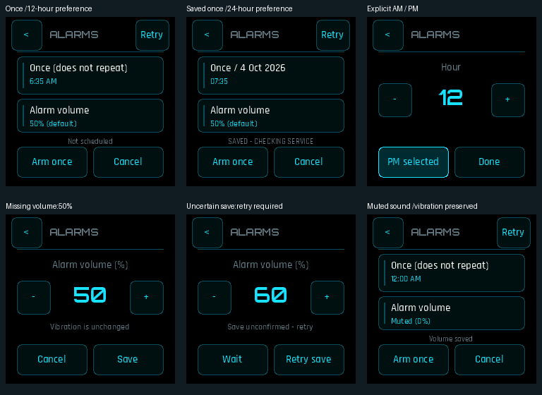

# Alarms 0.2.0: Nova controls, Once, time format and volume

The selected Nova profile uses the actual Settings fonts, palette and large
rounded controls. The alarm time and volume are separate touchable cards; the
nested Hour/Minute editor has 48px +/- buttons and an explicit AM/PM button
when the namespace-1 time-format setting is 12-hour. Hour wrap preserves the
selected half-day. Storage remains in the explicit namespace-3 alarm record.

The primary action says **Arm once**. The screen says **Once (does not repeat)**
and shows the actual scheduled local date after saving. It does not imply an
unimplemented repeating-alarm feature. Countdown has a separate app activation
and version; the shared file alone does not opt it into the new controller.

The volume editor supports 0–100% in ten-point steps. A missing setting shows
50% (default), without silently writing it. Existing explicit values are kept.
Save requires exact readback; uncertain results lock navigation/edits and offer
an exact retry. Cancel leaves the confirmed value alone. Zero explicitly shows
Muted, with vibration unchanged. Namespace-1 `alarm_volume` is a one-byte
shared setting; actual backend volume needs the separate service 0.4.0 patch.
A UI-only upgrade does not increase old service PCM volume.

These are actual production app/controller/adapter renders with deterministic
hardware fakes, not a substitute UI. Cases cover 12/24 time, explicit AM/PM,
Once/date display, default/selected/muted volume, readback uncertainty and retry.
`test_nova_utility.py --app alarms` passes the actual touch-through-adapter
flows under normal and ASan/UBSan builds. `test_nova_alarm_volume.py` adds 18
controller/persistence/render executions, including all 24 hours in both time
formats, midnight/noon/wrap and independent preference keys. The existing
legacy Alarm/Countdown app/service tests remain required and pass separately.

The app does not own haptic/audio outputs, recurrence, sleep, namespace cleanup
or an independent modal overlay. Current audio/service code is byte-identical
to the current main dependency; the shared adapter retains those lifecycles.
No physical loudness qualification or device action is claimed.
