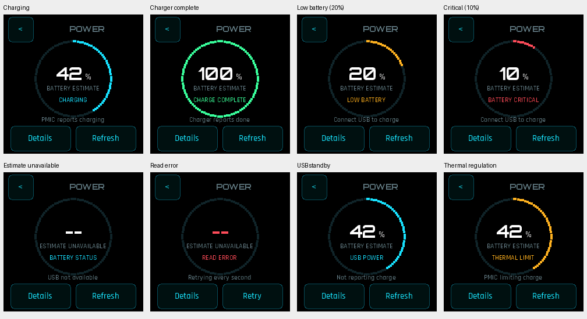
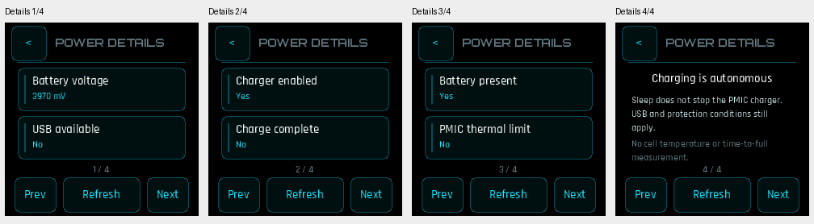

# Battery1.1.0 power screens

The opt-in 240x240 NOVA power view uses the supplied Power Screens reference's
black background, cyan progress ring, large percentage, green completion and
amber/red low-battery accents. It uses real production fonts and presentation
through the existing shared System adapter. All touch controls are at least44px.

Observable states are charging, charger-complete, usable USB without reported
charging, charging-disabled, battery-present/absent, low20%, critical10%, unknown
estimate, PMIC thermal regulation, basic-provider fallback and transport error.
Zero is a real estimate. Estimated100% never means charger-complete. Read failure
clears old values and retries every second; refresh/retry remains available.

Four Details pages expose voltage, usable USB, enable/completion, presence,
PMIC thermal regulation and a short explanation of autonomous charging. Back
returns from Details to the overview, then to Springboard. Failed navigation
stays on-screen for retry. The app preserves existing sleep, alarm and quick
control behavior, and a queued external launch is never replaced by an app return.

The screen refreshes when readings change or the user interacts. It does not
animate continuously, write preferences or alter charge settings. It samples at
most once per second while idle, without resetting the existing60-second idle
sleep timer. A resumed/refused sleep preserves the selected details page;
retained/error sleep exits before further reads or draws.

The reference's wireless/fast-charge, watts, time-to-full,80% hold, automatic
low-power mode,1% reserve,43C cell cutoff, shutdown and boot animations are not
implemented. The available contracts do not establish those features. PMIC
thermal regulation is not a cell-temperature reading. USB-good is usable input,
not proof that a disconnected/unsupported cable was detected. There are no
invented values or charger-control buttons.

## Build and integration

The independently pinned System prerequisite is
[`4cf36b1c46641b00d88535eb9a0e9b0797928aff`](https://github.com/michaelrolphone-cmyk/RiscRTE-System-Apps/pull/51).
Build with `python scripts/build_battery_power.py --system-apps <clean-pin>`.
`NATIVE_APP_CC` selects the existing GCC8.4 Xtensa compiler.

The next Watch cohort must choose Battery1.1.0 and PMU0.6.1, pin the integrated
System and Utilities sources, and add `PORTABLE_POWER_STATUS` only for Battery.
Use `BATTERY_RETURN_APP="springboard.elf"` instead of `PORTABLE_RETURN_APP` for
this app, preserving in-app Back. Existing Battery source/legacy builds without
both NOVA and power macros retain the previous list UI. No Runtime change or
new data grant is required; all prior settings and application data stay intact.

## Verification

-20 scenarios with real app and shared adapter, each normal and ASan/UBSan:
  all states above, changing input/charge/error/recovery, all Details pages,
  repeat navigation, nested Back, refresh, failed launch/retry, resumed/refused
  idle sleep and retained/error exits
- Framebuffer stride guards, bounded polling, unchanged-reading repaint
  suppression, no storage writes and complete ordinary resource cleanup
- Existing Battery detailed/legacy/unknown/read-failure tests and the full
  Utilities app fixture suite
-64 Utilities unit tests
- Exact-pinned GCC8.4 target ELF structural/import/export verification

Screenshots are production-source framebuffer captures with fixture readings,
not measurements from a physical watch. Physical charging/current/protection,
gauge accuracy and on-device appearance remain unqualified. No BIN or release
is published by this increment.
