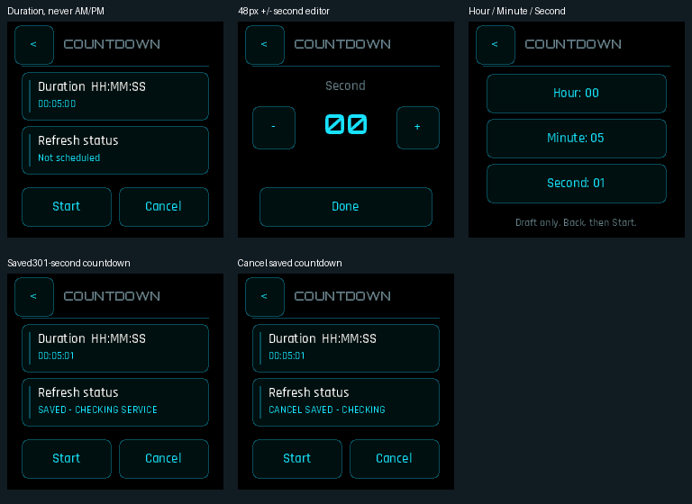

# Countdown 0.1.3: shared Nova duration controls

This separate app activation adopts the Settings-derived Nova profile already
used by Alarms. The duration is clearly HH:MM:SS, independent of the clock's
12/24-hour preference. Large Hour, Minute and Second controls lead to48px +/-
buttons; Back remains nested until the root view. Start and Cancel are explicit
100×44 buttons with a gap. The service still owns timing, outputs and cleanup.

The real app/adapter touch fixture edits a duration to301seconds, saves it, and
separately cancels it with verified revision/state. Both normal andASan/UBSan
runs pass, alongside existing countdown zero/range/clock-error/readback-uncertain
and service regression fixtures. The screens show the exact saved/checking
state returned by the deterministic provider fixture. PinnedGCC8.4 targetELF
structure/import/export checks pass. No physical qualification is claimed.

No new storage authority: the schedule is read/written through namespace3.
Elapsed countdown display continues to derive from the service deadline, never
from an AM/PM interpretation. Alarm volume affects actual sound only when the
matched service0.4.0 prerequisite is deployed; vibration remains independent.
